### Hello, I am BJTMastermind

* I started programming in January of 2018.
* My favorite language is Java.
* My editor of choice is [VSCodium](https://vscodium.com/) for every language.
* All things Minecraft are kind of my thing. If you don't believe me you can look at my Minecraft collection [Here](./MinecraftVersions.md)
  
### Member of [Team Lodestone](https://github.com/Team-Lodestone)

### Contributed To
* [Logical Zoom](https://github.com/LogicalGeekBoy/logical_zoom)

<!--

   
Subscribe To My YouTube Channel

-->
 

